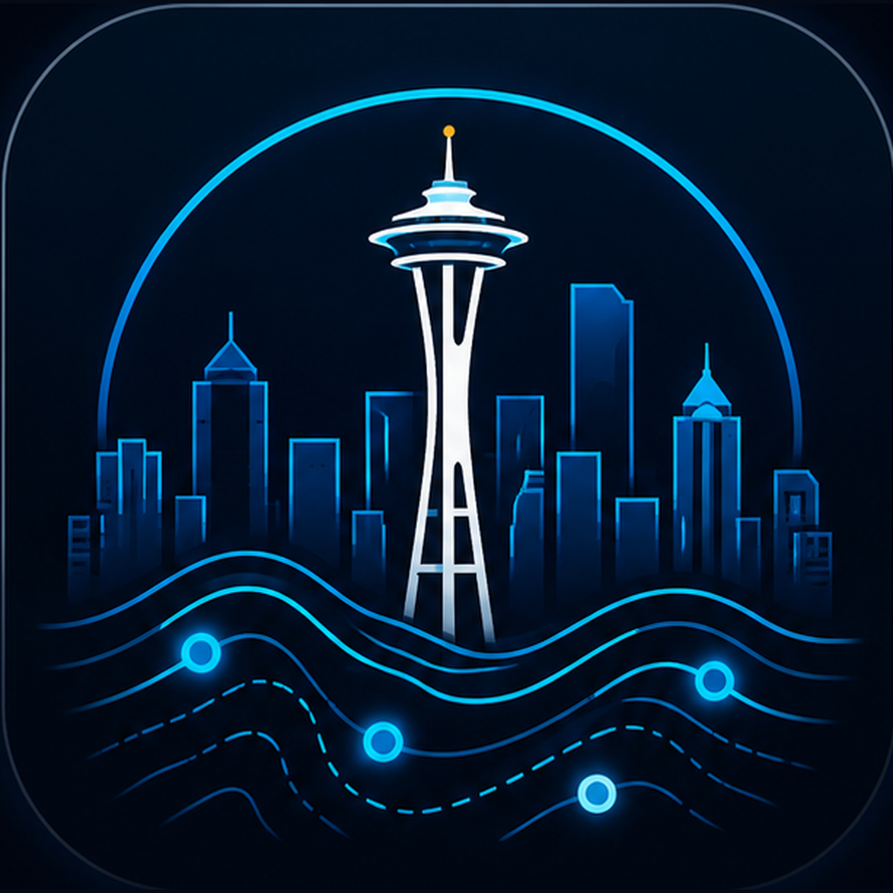

# Seattle GeoData Explorer



Seattle GeoData Explorer is a map-first web app for finding, loading, and inspecting Seattle public GIS data. It combines a searchable civic data catalog, live ArcGIS web layers, feature inspection, and attribute table exploration in one focused workspace.

The app was built as a WAGISA Map Contest submission and as a practical prototype for faster, more approachable public GIS data discovery.

---

## What It Does

- **Search the catalog** — Browse Seattle public GIS datasets with search, sorting, and filters for type, category, owner, and tags.
- **Load live layers** — Add supported ArcGIS services directly to the map and manage visibility, opacity, tables, and source links.
- **Inspect map features** — Click features to review attributes in a focused inspector panel.
- **Explore attributes** — Open ArcGIS FeatureTable views in a floating desktop table panel, a fullscreen table workspace, or a mobile-friendly fullscreen table sheet.
- **Use map tools** — Search places, switch basemaps, view the legend, return home, use scale/compass widgets, and keep exploring without leaving the map.
- **Work across screen sizes** — Use a collapsible desktop sidebar or a mobile bottom drawer designed for catalog browsing on smaller screens.

---

## Current App Experience

The current iteration includes:

- A custom Seattle GeoData Explorer logo, favicon set, app icons, and web manifest.
- A dark navy/cyan dashboard interface built around the map.
- A searchable catalog powered by Seattle public GIS metadata.
- Active layer and active table management.
- Feature details and project notes in the inspector panel.
- A dedicated table workspace with maximize, restore, and close controls.
- Mobile drawer behavior for the catalog and fullscreen mobile table viewing.
- GitHub, LinkedIn, share, and project information controls in the sidebar header.

---

## Tech Stack

| Technology | Purpose |
|---|---|
| **Vite** | Development server and production build tooling |
| **ArcGIS Maps SDK for JavaScript** | Map rendering, layers, widgets, FeatureTable, and GIS interaction |
| **Vanilla JavaScript** | Application state, UI composition, catalog workflows, and map orchestration |
| **CSS** | Dark theme, responsive layout, mobile drawer, table workspace, and app polish |
| **HTML** | App shell, metadata, splash screen, and progressive web app links |

---

## Getting Started

### Prerequisites

- Node.js 18+ and npm

### Development

```bash
git clone https://github.com/benjiantolin/seattle-geodata-explorer.git
cd seattle-geodata-explorer
npm install
npm run dev
```

Vite will print the local URL, usually:

```text
http://localhost:5173/seattle-geodata-explorer/
```

### Production Build

```bash
npm run build
```

### Deploy to GitHub Pages

```bash
npm run deploy
```

---

## Data Source

The catalog is generated from Seattle public GIS metadata and points to live ArcGIS services where available. Dataset availability, service capabilities, schemas, and update frequency are controlled by the source publishers.

Primary source: [Seattle GIS Open Data](https://data-seattlecitygis.opendata.arcgis.com/search)

---

## Contest Information

**Competition:** WAGISA Map Contest 2026  
**Category:** Apps - interactive browser/mobile experiences  
**Organization:** Washington GIS Association

This project demonstrates how a focused custom web app can make public GIS data feel more immediate, visual, and usable for exploration.

---

## Rapid Development

Seattle GeoData Explorer was developed through rapid iteration with support from GitHub Copilot, ChatGPT, and Codex. These tools helped accelerate UI exploration, refactoring, testing ideas, documentation, and implementation details while keeping the final product guided by GIS workflow judgment and human review.

---

## Project Inspiration

This application draws inspiration from:

- The 2026 Esri Developer & Technology Summit
- Modern ArcGIS Maps SDK and web GIS patterns
- Calcite-style interface conventions and compact dashboard workflows
- Seattle public GIS data and civic technology use cases
- Seattle Public Utilities' Utiliview Web Mapping Application
- The idea that public data catalogs can become interactive geospatial workspaces

---

## License

This project is open source and built for educational, civic technology, and community GIS purposes.

---

## Author

Built with care by [Benji](https://github.com/benjiantolin).

Special thanks to GitHub Copilot, ChatGPT, and Codex for supporting rapid development and iteration.
